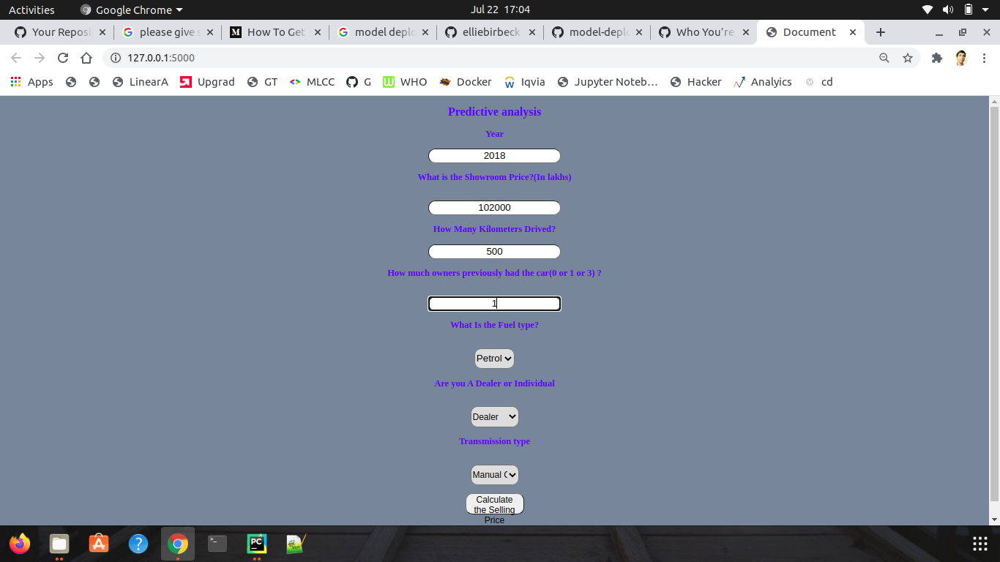
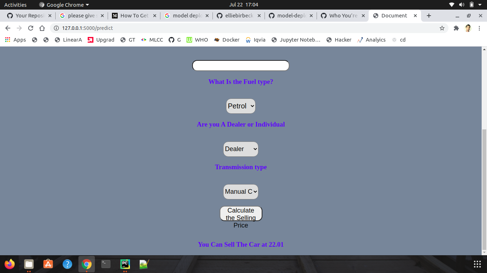

## Follow Me:

    

## Hi there 👋

### Library Installation :
 -  pip install -r requirements.txt 

### Train the model :
 - python model.py

### Predict the model
 - python app.py
 

### Input :

### Output :

## Please Star me on GitHub 
## Please follow me on GitHub
https://github.com/RakeshKumar045

#### This is an end to end project with deployment in Heroku.
This is a Flask web app which predicts selling price of Car based on several factors like km drived, type of car,years used.
Code is written in Python and the model is built using randomforest regressor.
The created model is exposed as a web API to be consumed by the client/client APIs,using the flask framework
We create a web app using Flask Framework.
Heroku is a Platform as a service (PAAS)
#### Flow of Flask Framework :

Landing Page (Index.html)  ---> Python app (app.py) -----> Results page (results.html)

#### Procfile : it contains the command to run the flask application once deployed on the server

  web: gunicorn app:app
 web --> specifies its a web application
 app: app   -----> program looks for a flask application called app inside the app.py file.
 gunicorn is a web server gateway interface (WSGI)HTTP server  for python 
#### pip freeze > requirements.txt’. This command generates the ‘requirements.txt’ file
#### Deployment to Heroku:

Create a app in heroku and use code from github to deploy.
After deployment, heroku gives you the URL to hit the web API
Once your application is deployed successfully, enter the command ‘heroku logs --tail’ to see the logs.

### Demo : 
https://carpredictionapp1.herokuapp.com/

## Thank you for reaching out to me on Github. 
