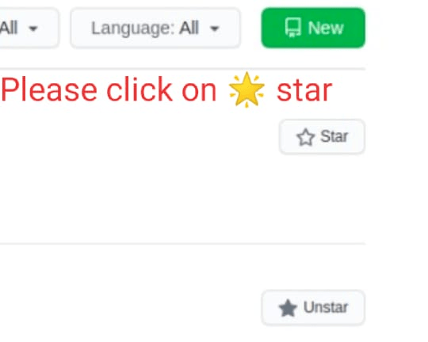

# Flight Fare Prediction: 

## Follow Me:

 [](https://www.linkedin.com/in/rakesh-kumar-gupta-52b77ab4/) [](https://www.kaggle.com/rakesh6184) [](https://twitter.com/2702rakesh) [](https://medium.com/@2702rakesh)

## Hi there 👋


## Overview
This is a Flask web app which predicts fare of Flight ticket.


### Library Installation :

```bash
pip install -r requirements.txt
```

### Train the model on Jupyter Notebook:
 - flight_price.ipynb

### Predict the model
 - python app.py
 

### Input :


### Output :


## Demo
Link: [https://flight-price-prediction-api.herokuapp.com/](https://flight-price-prediction-api.herokuapp.com/)

[](https://flight-price-prediction-api.herokuapp.com/)

[](https://flight-price-prediction-api.herokuapp.com/)


## Deployement on Heroku
Login or signup in order to create virtual app. You can either connect your github profile or download ctl to manually deploy this project.

[](https://heroku.com)

Our next step would be to follow the instruction given on [Heroku Documentation](https://devcenter.heroku.com/articles/getting-started-with-python) to deploy a web app.

## Please Star me on GitHub 
## Please follow me on GitHub
[](https://github.com/RakeshKumar045?tab=repositories)

https://github.com/RakeshKumar045?tab=repositories




## Technologies Used


[](https://flask.palletsprojects.com/en/1.1.x/) [](https://gunicorn.org) [](https://scikit-learn.org/stable/) 


## Thank you for reaching out to me on Github. 
